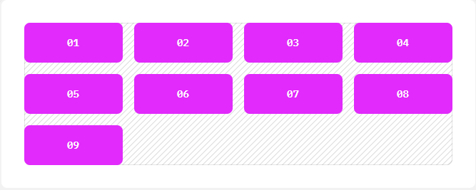
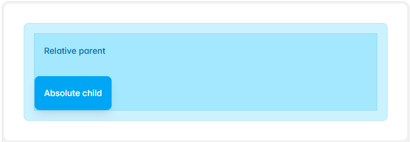
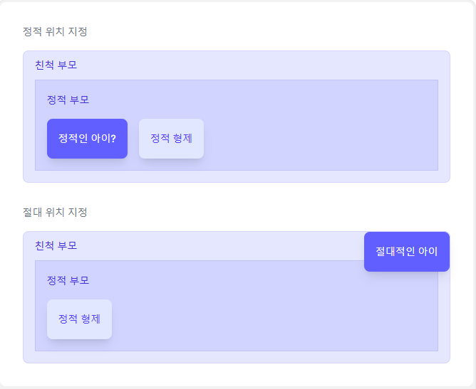

# Tailwind CSS 연습

## 1. HTML 자동 완성 후 tailwind css cdn source script tag 삽입

### 1.1. ! 입력 후 tab 입력 으로 HTML 자동완성
```html
! 입력 후 tab 입력
```
### 1.2. <header> tag 에 `tailwind css cdn source script tag 삽입`
<script src="https://cdn.jsdelivr.net/npm/@tailwindcss/browser@4"></script>

```html
<!DOCTYPE html>
<html lang='ko'
<head>
  <meta charset="UTF-8">
  <meta name="viewport" content="width=device-width, initial-scale=1.0">
  <title>Tailwind CSS</title>
  <!-- Tailwind CSS cdn source script tag 삽입 -->
  <script src="https://cdn.jsdelivr.net/npm/@tailwindcss/browser@4"></script>
</head>
<body>
    ......
</body>
</html>
```

## 2. Tailwind css snippet 으로 HTML 틀 자동완성

### 2.1. ctrl + shift + p > Snippets: Configure Snippets > html.json 선택
- tailwind-html snippet template 만들기

```json
{
	"Tailwind CDN Template": {
		"prefix": "tailwind-html",
		"body": [
			"<!DOCTYPE html>",
			"<html lang='ko'",
			"<head>",
			"  <meta charset=\"UTF-8\">",
			"  <meta name=\"viewport\" content=\"width=device-width, initial-scale=1.0\">",
			"  <title>$1</title>",
			"  <script src=\"https://cdn.jsdelivr.net/npm/@tailwindcss/browser@4\"></script>",
			"</head>",
			"<body>",
			"    $1",
			"</body>",
			"</html>"
		],
		"description": "Basic HTML structure with Tailwind CSS CDN"
	}
}
```

### 2.2. Tailwind CSS HTML 자동완성 사용하기
- html 파일에서 html.json 에 정의한 prefix 입력

```html
tailwind-html

```

**➡️ snippet 사이트 사용 : `https://snippet-generator.app` 접속**
- 왼쪽 창에 snippet 템플릿화 할 소스 코드 붙혀넣기 
(javascript JSX, typescript, typescript JSX 소스 코드 틀)
- 오른 쪽 창에서 코드 내용 copy 해서
- vs code 에서 ctrl + shift + p
- Snippets: Configure Snippets
- javascriptreact, typescript, typescript JSX 선택해서 붙혀 넣기

## 3. VS Code 확장팩 설치

### 3-1. Tailwind CSS IntelliSense 설치
- Tailwind CSS 클래스 명을 입력 할때 자동완성 지원 기능

### 3-2. Tailwind CSS Intellisense 활성화

- workspace\tailwind.config.js 생성

```javascript
/** @type {import('tailwindcss').Config} */
module.exports = {
  content: ["./src/**/*.{html,js}"],
  theme: {
    extend: {},
  },
  plugins: [],
}
```

### 3-3. prettier - Code formatter  확장팩 설치
- 에디터의 formatter 설정, 저장시 전체 파일의 포멧을 함

### 3-4. ctrl + , 로 Settings 의 설정 ( 사용자 / 작업영역: workspace\.vscode\setting.json )
- `Editor: Format on save` 를 `prettier - Code formatter` 로 설정
- `Editor: Format on save` 를 `체크`
- `Editor: Tab Size` 를 `2` 로 저장 ( 들여쓰기 2 칸 )
- workspace\.vscode\setting.json 확인

```json
{
  "editor.defaultFormatter": "esbenp.prettier-vscode",
  "editor.formatOnSave": true,
  "editor.tabSize": 2
}
```

### 3-5. prettier 설정

```json
{
  "arrowParens": "always",                  // 화살표 함수에서 괄호를 항상 사용
  "bracketSpacing": true,                   // 객체 리터럴에서 중괄호와 속성사이에 공백 추가 
  "endOfLine": "auto",                      // 줄바꿈 스타일을 auto 로 설정
  "htmlWhitespaceSensitivity": "css",
  "jsxBracketSameLine": false,       
  "jsxSingleQuote": false,           
  "printWidth": 80,                         // 한줄에 80 자 까지 작성 
  "proseWrap": "preserve",           
  "quoteProps": "as-needed",          
  "semi": true,                             // 세미콜론 항상추가   
  "singleQuote": true,                      // 문자열에 홑 따옴표 사용
  "tabWidth": 2,                            // 텝 사이즈 2
  "trailingComma": "es5",                   // ES5 에서 유효한 곳에만 후행 콤마 추가
  "useTabs": false,                         // 탭 대신 스페이스 사용 
  "vueIndentScriptAndStyle": true,   
  "overrides": [ 
    {
      "files": "*.json",
      "options": {
        "printWidth": 200
      }
    }
  ]
}
```

---

## 4. Typograpy 스타일링

### 4.1. 글꼴크기(text-)
```html
text-2xl, text-sm, text-lg
```
### 4.2. 글꼴두께(font-) 
```html
font-bold, font-sm, font-lg
```
### 4.3. 텍스트정렬(text-)
```html
text-center, text-left, text-right
```
### 4.4. 텍스트색상(text-)
```html
text-red-500, text-blue-500, text-green-500
```
### 4.5. 줄 간격(leading-)
```html
leading-none, leading-tight, leading-relaxed
```
### 4.6. 텍스트 오버플로우(text-)
```html
text-ellipsis, text-clip, text-nowrap
```

---
## 5. container

### 5.1. 기본 개념
- container 클래스를 사용하여 **`다양한 브레이크포인트 (화면의 해상도)`**에 맞춘 **`반응형 레이아웃`**을 구현
- 웹 레이아웃에서 Content 영역을 까끔하게 정리하고 **`중앙에 배치`** 하는데 주로 사용
- 웹 페이지의 본문 **`Content`**나 주요 **`Section`**을 **`지정된 너비`** 안에 **`고정`** 
---

### 5.2. Breakepoints

| Breakpoint | Properties |
| :---: | :---: |
| None | width: 100%; |
| sm (640px) | max-width: 640px; |
| md (768px) | max-width: 768px; |
| lg (1024px) | max-width: 1024px; |
| xl (1280px) | max-width: 1280px; |
| 2xl (1536px) | max-width: 1536px; |

### 5.3. 주요 역할
- 웹 페이지에서 Contents 가 화면크기에 맞춰 잘 정리 되게 해줌
- 만약 화면이 너무 크거나 작으면 Contents 가 지나치게 퍼지거나 너무 좁아지는 것을 방지 해 줌
- contents 가 가로 길이를 적당하게 제한하여 어떤 화면 크기에도 보기 좋게 유지
- 해상도가 큰 모니터에서 contents 가 너무 넓게 퍼지지 않게 해주고 작은 화면에서는 Contents 가 잘리지 않고 적절하게 표시

### 5.4. None : 모든 화면 크기에서 컨테이너 규칙이 적용됩니다.
```html
<div class="container mx-auto">
  <h1 class="text-3xl font-bold">웹 페이지 타이틀</h1>
  <p>이 영역은 컨테이너 안에서 중앙에 배치되면, 화명 크기에 맞춰 최대 너비가 조절됩니다.</p>
</div>
```

```html
<div class="container mx-auto"></div>
```

### 5.5. sm : 컨테이너는 기본 적용하되, 가운데 정렬만 640px 이상에서 하고 싶다.  
```html
<div class="container sm:mx-auto"></div>
```

### 5.6. md : 768px 이상에서부터 컨테이너 규칙을 시작하고 싶다.
```html
<div class="md:container md:mx-auto"></div>
```

### 5.7. mobile first 방식

**- Mobile first web design**
- 모바일 디바이스를 기준으로 웹사이트 또는 앱을 디자인하는 접근 방식
- 실제 @media (min-width: 640px) { ... } 같은 형식의 미디어 쿼리를 사용
- 낮은 해상도 부터 높은 해상도 순으로 스타일을 구현할 수 있다.

**- Desktop first web design
- 데스크톱 환경을 주요 디자인 대상으로 삼는 접근 방식
- 실제 @media (max-width: 1280px) { ... } 같은 형식의 미디어 쿼리를 사용
- 높은 해상도 부터 낮은 해상도 순으로 스타일을 구현

```html
<!-- 640px 이상의 화면에서만 텍스트를 중앙에 배치합니다. -->  
<div class="sm:text-center"></div>

<!-- 모바일에서는 텍스트를 중앙에 배치하고 640px 이상의 화면에서는 왼쪽 정렬합니다. -->
<div class="text-center sm:text-left"></div>
```

### 5.7. breakpoint 범위 설정
**-특정 breakpoint 범위가 활성화하려면 md와 같은 반응형 수정자를 max-* 수정자와 함께 스택하여 해당 스타일을 특정 범위로 제한**

```html
<div class="md:max-xl:flex">  <!-- ... -->  </div>
```

### 5.8. 각 중단 점에 해당하는 max-수정자

| 수정자 | 미디어 쿼리 |
| :---: | :---: |
| max-sm | @media not all and (min-width: 640px) { ... } |
| max-md |@media not all and (min-width: 768px) { ... } |
| max-lg | @media not all and (min-width: 1024px) { ... } |
| max-xl | @media not all and (min-width: 1280px) { ... } |
| max-2xl	 | @media not all and (min-width: 1536px) { ... } |


### 5.8 사용자 정의 테마
- tailwind.config.js 파일에서 breakpoint 들을 사용자 정의
```javascript
// tailwind.config.js
/** @type {import('tailwindcss').Config} */

module.exports = {
  theme: {
    screens: {
      'tablet': '640px',
      // => @media (min-width: 640px) { ... }

      'laptop': '1024px',
      // => @media (min-width: 1024px) { ... }

      'desktop': '1280px',
      // => @media (min-width: 1280px) { ... }
    },
  }
}
```

## 6. flex

### 6.1. 기본 개념

- <div> Tag 는 기본적으로 y 축으로 위에서 부터 아래로 자식들이 표시 됨
- flex 로 <div> Tag 의 자식들의 y 축 표시를 x 축으로 좌에서 부터 우로 표시
```html
<div class="flex">
  <div>A</div>
  <div>B</div>
</div>
```

### 6.2. flex-1 부모의 나머지 공간을 차지

- 메인 화면의 레이아웃
```text
┌──────────────────────────────┐
│ Header                       │
├──────────┬───────────────────┤
│ LNB      │ Main              │
│          │                   │
│          │                   │
└──────────┴───────────────────┘
```

```html
<header class="w-full">Header</header> <!-- header 영역 -->

<div class="flex h-screen"> <!-- Flex 부모 컨테이너, 자식 들을 x 축으로 표시, 화면 y 축 full 로 표시  -->
  <aside className="w-64"> <!-- Flex item A, 가로로 좌측 64px -->
    LNB
  </aside>

  <main className="flex-1"> <!-- Flex item B, 가로로 좌측 64px 이후 부모 컨테이너 나머지 공간 영역 할당 -->
    Main
  </main>
</div>

```
---
## 7. Grid
- 그리드 레이아웃에서 열을 지정하는 유틸리티

### 7.1. 기본 사용

```html
<div class="grid grid-cols-4 gap-4">
  <div>01</div>
  <!-- ... -->
  <div>09</div>
</div>
```

### 7.2. 반응형 디자인
- 유틸리티 이름 앞에 중단점 변형을 붙여서 중간 화면 크기 이상 에서만 유틸리티를 적용하도록 할 수 있습니다 . 
```html
<div class="grid grid-cols-1 md:grid-cols-6 ...">
  <!-- ... -->
</div>
```
➡️ 기본은 grid 하나의 컬럼으로 동작하고 모바일 디바이스의 경우는 컬럼 6개인 grid 로 표시
---
## 8. Position : 문서 내 요소의 위치를 ​​제어하는 ​​유틸리티

| class | styles |
| :---: | :---: |
| static | position: static; |
| fixed | position: fixed; |
| absolute | position: absolute; |
| relative | position: relative; |
| sticky	 | position: sticky; |

### 8.1. Statically positioning elements
- 부모 콤포넌트와 상관 없이 고정된 위치에 배치


```html
<div class="static ...">
  <p>Static parent</p>
  <div class="absolute bottom-0 left-0 ...">
    <p>Absolute child</p>
  </div>
</div>
```

### 8.2. Relatively positioning elements
- 콤포넌트를 상대적으로 부모의 영역 내에 배치


```html
<div class="relative ...">
  <p>Relative parent</p>
  <div class="absolute bottom-0 left-0 ...">
    <p>Absolute child</p>
  </div>
</div>
```

### 8.3. Absolutely positioning elements

- 문서의 일반적인 흐름에서 벗어난absolute 위치에 요소를 배치하면 인접한 요소들이 해당 요소가 없는 것처럼 동작



```html
<div class="static ...">
  <!-- Static parent -->
  <div class="static ..."><p>Static child</p></div>
  <div class="inline-block ..."><p>Static sibling</p></div>
  <!-- Static parent -->
  <div class="absolute ..."><p>Absolute child</p></div>
  <div class="inline-block ..."><p>Static sibling</p></div>
</div>
```

### 8.4. fixed 와 sticky 차이

- 스크롤할 때 요소 고정용 사용
**- 차이 점**
| 클래스      | 기준                    | 스크롤 시                | 대표 용도                |
| -------- | --------------------- | -------------------- | -------------------- |
| `fixed`  | **브라우저 화면(Viewport)** | 항상 화면에 고정            | 헤더, 플로팅 버튼, 사이드바     |
| `sticky` | **부모 요소/스크롤 영역**      | 특정 위치까지 일반 흐름, 이후 고정 | 섹션 제목, 테이블 헤더, 서브 메뉴 |

**fixed**
- **`Header는 fixed`**
- 브라우저 화면의 top: 0에 고정 ( 지정요소를 뷰포트에 고정하여 스크롤해도 고정된 위치에 머무름 )
- 페이지를 아무리 스크롤해도 계속 같은 위치
- 일반 문서 흐름에서 빠짐
``` html
<div class="fixed top-0 left-0 w-full">
    Header
</div>
```
- 그림 예시
```text
┌─────────────────────┐
│      Header         │ ← 항상 화면에 고정
├─────────────────────┤
│                     │
│   스크롤되는 내용     │
│                     │
└─────────────────────┘
```

---
**sticky**
- **`테이블 컬럼 헤더나 섹션 제목은 sticky`**를 사용
- 스크롤시 요소가 지정된 위치에 도달하면 고정되며 그 이후에는 부모 요소의 끝에 도달 할때 까지 고정된 상태 유지

```html
<div class="sticky top-0">
    Section Header
</div>
```

- 그림 예시
```text
처음
┌─────────────────────┐
│ 테이블 내용....       │
│ Section Header      │
│ 내용 B               │
└─────────────────────┘

스크롤 후
┌─────────────────────┐
│ Section Header ← 고정│
├─────────────────────┤
│ 내용 A               │
│ 내용 B               │
└─────────────────────┘
```